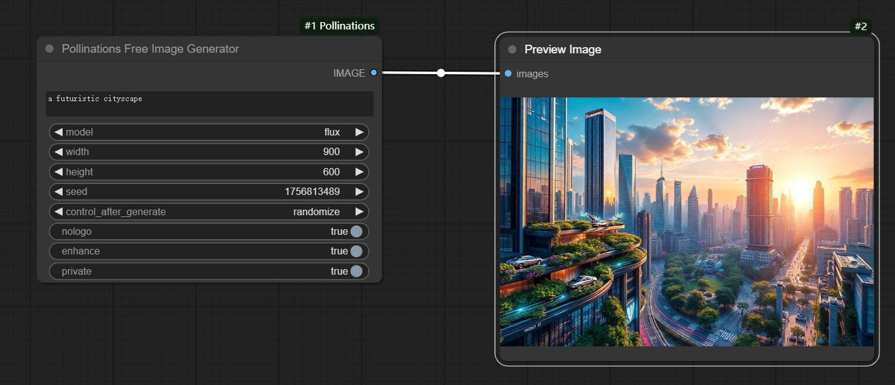

# ComfyUI-Pollinations

This custom node integrates the **Pollinations API** into **ComfyUI**, allowing you to generate images directly within your ComfyUI workflows using Pollinations' powerful AI models. No cost, No api key is required either.

---

## Features

- **Text-to-Image Generation**: Generate images from text prompts using Pollinations' AI models.
- **Customizable Parameters**:
  - **Model Selection**: Choose from multiple AI models (e.g., `flux`, `flux-realism`, `flux-anime`, etc.).
  - **Image Dimensions**: Set the width and height of the generated image.
  - **Seed Control**: Use a specific seed for reproducible results.
  - **Additional Options**: Enable/disable logo, enhance image quality, and set private mode.
- **Seamless Integration**: Outputs generated images as PyTorch tensors, compatible with other ComfyUI nodes.

---

## Installation

1. **Download the Node**:
   - Clone or download the `ComfyUI-Pollinations` folder from this repository.
   - Place the folder in the `custom_nodes` directory of your ComfyUI installation:
     ```
     ComfyUI/
     └── custom_nodes/
         └── ComfyUI-Pollinations/
             └── __init__.py
     ```

2. **Restart ComfyUI**:
   - Restart ComfyUI to load the new node.

3. **Verify Installation**:
   - Open ComfyUI and check if the `Pollinations Free Image Generator` node is available in the node list.

---

## Usage

1. **Add the Node**:
   - In ComfyUI, search for the `Pollinations Free Image Generator` node and add it to your workflow.

2. **Configure Inputs**:
   - **Prompt**: Enter a text prompt (e.g., "a futuristic cityscape").
   - **Model**: Select an AI model from the dropdown menu.
   - **Width/Height**: Set the dimensions of the generated image.
   - **Seed**: Optionally, set a seed for reproducible results.
   - **Options**: Toggle additional options like `nologo`, `enhance`, and `private`.

3. **Run the Workflow**:
   - Connect the output of the `Pollinations Free Image Generator` node to an image display or save node.
   - Execute the workflow to generate and view the image.

---

## Example Workflow

Here’s an example of how to use the `Pollinations Free Image Generator` node in a ComfyUI workflow:



1. Add the `Pollinations Free Image Generator` node.
2. Configure the inputs:
   - **Prompt**: "a futuristic cityscape"
   - **Model**: `flux`
   - **Width**: `900`
   - **Height**: `600`
   - **Options**: Enable `nologo`, `enhance`, and `private`.
3. Connect the output to an image display node.
4. Run the workflow to generate the image.

---

## Parameters

### Inputs
- **Prompt**: The text prompt describing the image you want to generate.
- **Model**: The AI model to use for image generation. Options include:
  - `flux`
  - `flux-realism`
  - `flux-anime`
  - `flux-3d`
  - `any-dark`
  - `flux-pro`
  - `turbo`
- **Width**: The width of the generated image (default: `900`).
- **Height**: The height of the generated image (default: `600`).
- **Seed**: A seed value for reproducible results (default: random).
- **Options**:
  - **nologo**: Disable the Pollinations logo in the generated image (default: `True`).
  - **enhance**: Enhance the image quality (default: `True`).
  - **private**: Enable private mode (default: `True`).

### Outputs
- **IMAGE**: The generated image as a PyTorch tensor.

---

## Troubleshooting

- **Node Not Found**: Ensure the `ComfyUI-Pollinations` folder is placed in the `custom_nodes` directory and restart ComfyUI.
- **API Errors**: Check your internet connection and ensure the Pollinations API is accessible. If the issue persists, verify the API URL and parameters.
- **Slow Performance**: Image generation may take some time depending on the model and image size. Consider reducing the dimensions or using a faster model.

---

## License

This project is licensed under the GPL-3 License. See the [LICENSE](LICENSE) file for details.

---

## Acknowledgments

- **Pollinations**: For providing the powerful image generation API.
- **ComfyUI**: For the flexible and extensible workflow framework.

---

## Support

For questions or issues, please open an issue on the [GitHub repository](https://github.com/ciga2011/ComfyUI-Pollinations) or contact the maintainer.

---

Enjoy generating stunning images with Pollinations and ComfyUI! 🎨